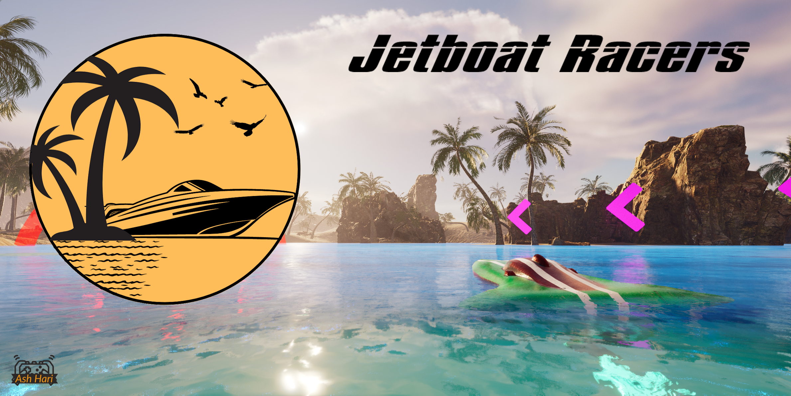

# Jetboat-Racers
## Description
Jetboat Racers is a multiplayer boat racing game with thrilling arcade physics, stunning environments, and many tracks to put your skills to the test.

This is a personal project I have been working on as a solo dev for nearly a year. It uses Unreal Engine 5, Autodesk Maya, and Adobe Substance 3D Painter.

Available soon on Steam.

Here is a short gif showing a small portion of the game trailer, please watch the full [Game Trailer](https://www.youtube.com/watch?v=Z_xtzHRfhOs)!

### - [Game Trailer](https://www.youtube.com/watch?v=Z_xtzHRfhOs)
### - See more on my [Artstation page](https://www.artstation.com/artwork/qelokD)

## Pictures

